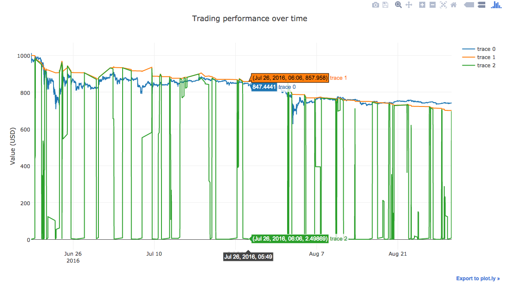

# CoinTK
## Smart Bitcoin Analyzing & Trading Toolkit

CoinTK -- An open-sourced platform for rapid prototyping and testing of BitCoin trading strategies, with visualiaztion features via our open-sourced iOS app [BitBox](https://github.com/CoinTK/BitBox). Machine Learning algorithms coming *Soon<sup>TM</sup>*.


<br>
# Getting Started

1. Download the code: ```git clone https://github.com/CoinTK/CoinTK.git``` and run ```[setup.py](setup.py).```
2. Press play: ```cointk/init.py```. Memes~
3. ???
4. [Profit](http://i1.kym-cdn.com/entries/icons/original/000/000/248/underpants.jpg)


In all seriousness -- you can get [full data](#data) if necessary, otherwise you can use test datasets included in ```data/``` (depending on your Strategy and parameters, you may not get any trade activity running on the sample datasets).


To get started, make sure that ```CoinTK/``` is in your ```$PYTHONPATH``` variable. You can do this by adding the line ```export PYTHONPATH=/path/to/this/folder/CoinTK:$PYTHONPATH``` to your ```~/.bash_profile```.

To make sure the platform is working, run ```python backtests/naive.py```. You should get something like this:




From here, you can play around with different strategies and testing parameters via scripts in ```backtests```, or start thinking about making your own [strategy](#creating-your-own-strategies).

Happy developing (and mining Bitcoins)!


# Data

Test dataset (of sizes 10k, 30k, 100k) in ```data/```
* [full dataset 2015/09-2016/12](http://api.bitcoincharts.com/v1/csv/coinbaseUSD.csv.gz)
* use ```csv_to_npz()``` function in ```cointk/data.py``` to convert csv to npz; 
  * e.g. ```csv_to_npz('data/coinbaseUSD.csv', 'data/coinbaseUSD.npz')```


# File structures

```cointk/``` contains most of the algorithmic work

* ```strategies/``` contains different buying/selling strategies, which is just a decision framework based on the given state of price/quantity and past histories

** ```prescient``` contains strategies that have access to perfect information, i.e. all historical and future data. These are only useful for a Machine Learning extension we will build in the future, which we hope to train to model such a prescient strategy *without* having perfect informaiton.

```backtests/``` tests strategies running on historical data, so you can evaluate performance had you ran this strategy since the beginning

```plots/``` contain plots generated locally by ```plotly``` -- such as when you run [backtest.py](cointk/backtest.py).

```trainings/``` contain support files for ```cointk/strategies/prescient```, which will be flushed out with


# Creating your own strategies

To create your own strategy, create a file in ```cointk/strategies``` similar to one of the sample strategies given: [Naive](cointk/strategies/hp_naive.py), [Reverse Naive](cointk/strategies/naive_reverse.py), [Random](cointk/strategies/simple_random.py). It should inherit the ```Strategies``` class (defined [here](cointk/strategies/core.py)) and have a 

	gen_order(self, ts, price, qty, funds, balance): 

function that decides, given the tuple (ts, price, qty) and any past histories stored in the Strategy Class, whether to buy or sell.


# Backtesting

Backtesting graphs are generated on the validation set. To change its size, change the value of ```train_prop``` and ```val_prop``` when calling ```backtest().```